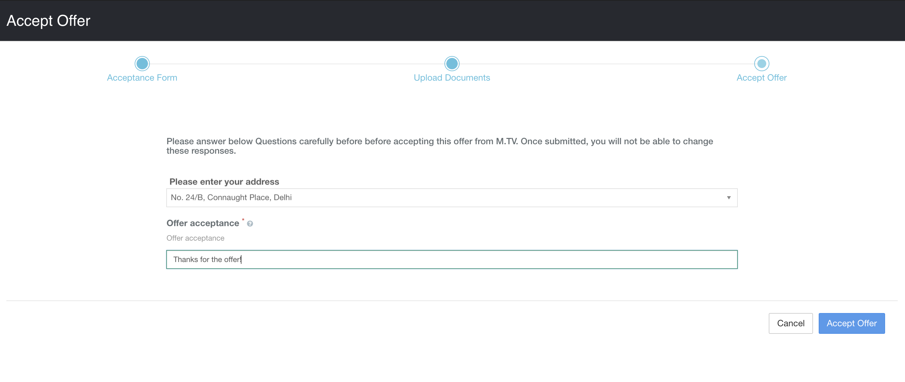

# Accepting an Offer from a company

### Job Offer

* When you are given an offer from the company for a job profile, then, when you visit the Job Profiles tab, you will see an 'Offered' tag in front of the Job Profile (see image below).

.png>)

### Job Offer Acceptance

* The next step after you have been offered is Accepting the Offer.&#x20;
* Go to the **Job Profiles **section from your Superset Home page
* Select the job profile that you have been offered
* After opening the job profile, you should be able to see the **Accept **button.
* **The 'Accept' button will be activated by the company, meaning, even if you see 'Offered' for a job, it might take some time for you to start seeing the 'Accept' button. Please be patient.**

.png>)

* **You **_**may be**_** asked to fill an** **Acceptance Form** **after clicking on the 'Accept' button. If there is no acceptance form then you should directly see a screen like the one in the last screenshot.**
* If you are asked to fill an acceptance form. It will be similar to the one shown below.&#x20;

.png>)

* Click on **Accept Offer **button
* You will see another step asking you to enter your superset account password and click 'Continue'.

* After accepting the offer, you will be redirected to the Job Profile page where you should see your offer as **Accepted.**

