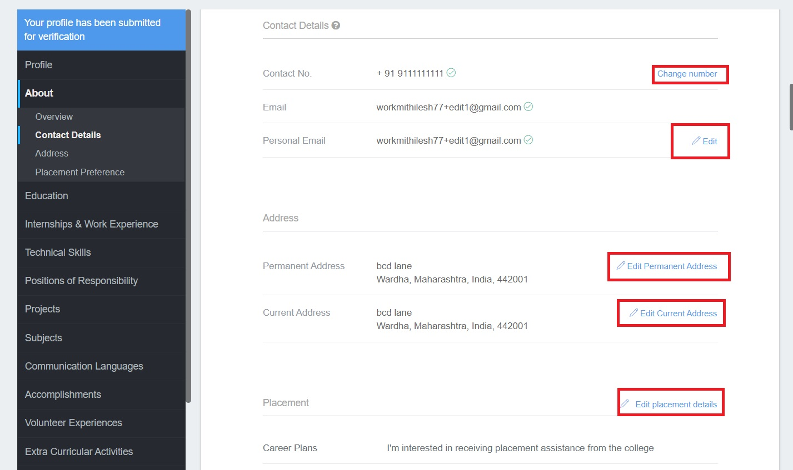

# I want to change my personal/academic details. How to do it?

If you are using Superset to apply for a job and want to change your personal/academic details, please refer to the below options:

## Edit my course, backlogs, marks/scores, and pass out batch

You can now edit the Education Details section of your profile on your own. Your new edits will be visible on your profile as soon as you update it, **Superset or your TPO don't have to "approve" these edits made by you.**\
**To make the edits log in to your Superset profile on a laptop/tablet browser:**

1. **Go to the "My Profile" tab**
2. **Scroll down to the "Education" section**
3. **Click on the "Edit" icon that appears on the bottom left**
4. **Make the changes and click on "Save"**

.png>)

## Edit my phone number, personal email ID, address, and career plans

You can now edit these personal details on your own. Your new edits will be visible on your profile as soon as you update it, **Superset or your TPO don't have to "approve" these edits made by you.**\
**To make the edits log in to your Superset profile on a laptop/tablet browser:**

1. **Go to the "My Profile" tab**
2. **Scroll down to that respective section**
3. **Click on the "Edit" icon that appears on the right**&#x20;
4. **Make the changes and click on "Save"**

## Edit my name, date of birth, gender, and primary email ID

To make edits to these personal details please click on the **Contact Support** button below. Please mention the following details clearly in your support request -

1. **What details are you trying to changes?**

&#x20; 2\. **What should these details be changed to?**

Name (First, Middle & Last Name) - Your full name with official supporting documents

DOB  - Your correct DOB with official supporting documents

Gender - Your correct gender

Email ID - Your correct email ID

****

