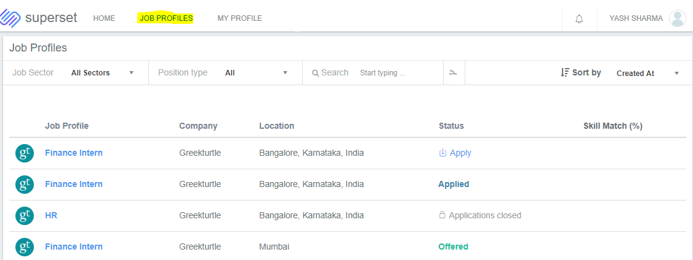
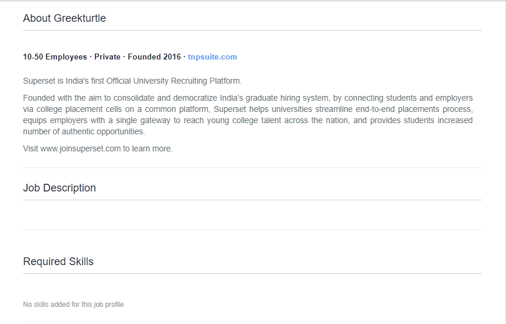
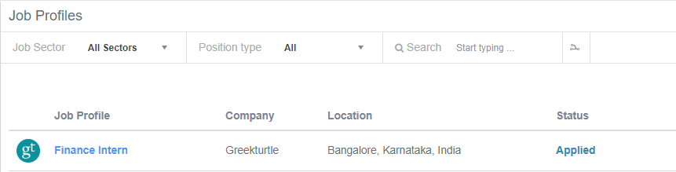

# Making a job application

### Accessing Job Profiles

* Login to your profile and go to the Job Profile tab.

* In this section, you will find the list of all the job profiles posted in a placement cycle in which you are enrolled.

**Click on a job profile name to view its details as follows :-**

#### Opening Overview 

It consists of the category in which the job profile falls into as per the placement policy \(as defined by placement team\), job function and the CTC that is being offered for this particular profile.

#### About Company

It consists of relevant information about the company.

#### Job Description

It consists of the detailed description of the job profile

#### Required Skills

Skills required for the job role

#### Hiring Workflow

The stages for this particular job profile along with the venue, date and time of that particular stage \(if mentioned while posting the job\)

#### 

#### Attached Documents

If any document/ presentation is attached with the job profile when posted by the placement team, it will reflect here.

#### Eligibility Criteria Evaluation Result

Here you will see whether you are eligible or not eligible to apply for the job profile on the basis of the placement policy and the eligibility criteria that is mentioned while posting the job. 

### How to apply for a job profile

* The option to apply is available on the top right corner of the job profile page as shown.

* Once you click on "Apply for this profile" , a window will pop up where you have to select the resume via which you want to apply for this job.
* Also, you have to answer some additional questions \(if it has been added by the placement team while posting the job\) relevant to the job profile.

* After selecting the relevant resume and answering the questions, you need to click on Apply button.
* After applying, you will see the option to withdraw your application \(if applicable\) and when you go back to the previous page where all the job profiles are listed, you will see the status changes to "Applied" and you may receive an email mentioning that your application has been submitted successfully.

