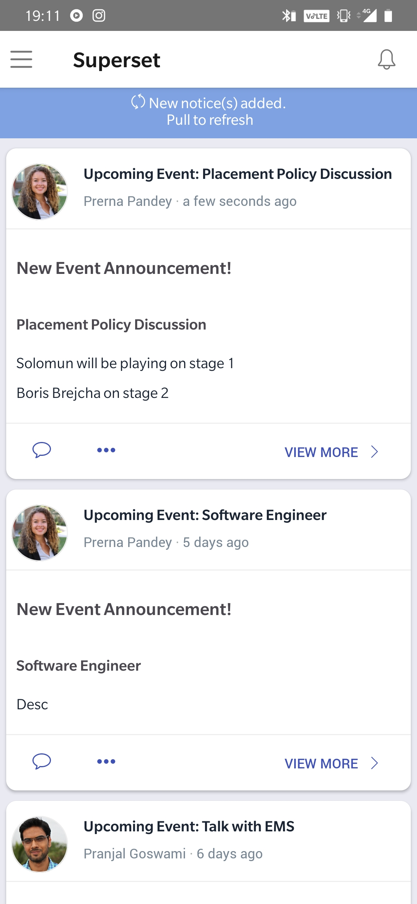
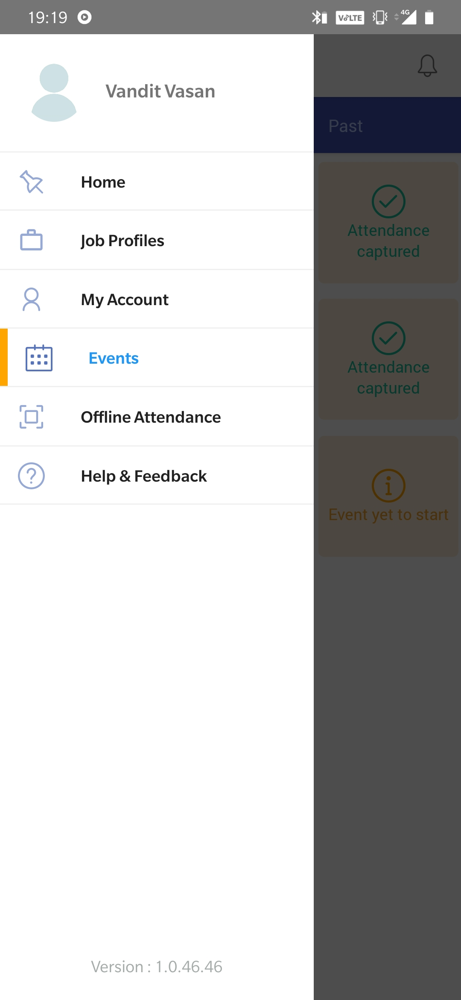
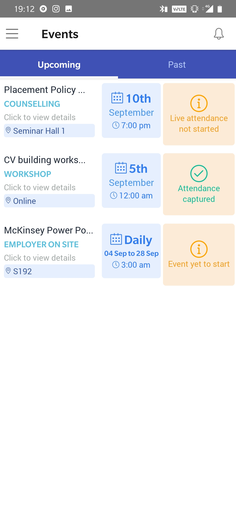
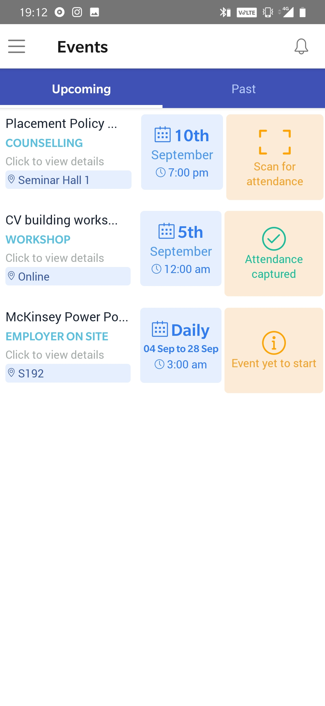

# Live attendance for events and job profiles

## Login to the app

* Login to the Superset app using your email id and password
* Remember that you **MUST BE ENROLLED **to a placement cycle to login and use the app successfully

## Home Page&#x20;

The home page of the mobile application will show you the notification feed. You will be able to look for the most recent updates&#x20;

## Checking for Events and RSVP&#x20;

You can check for any upcoming events and RSVP to them from the events tab on the mobile app. To reach the events click on the burger button on the top left corner and click events

## Events&#x20;

The events tab will show you the list of on going events. This tab will also show you the list of upcoming rounds if you're part of a job profile process. This section will allow you to open the QR code scanner from where your attendance can be submitted.&#x20;

Click on the event to view more details.&#x20;

To submit attendance, click on the **Scan for attendance **button and ensure your camera is facing towards the QR code displayed in front of you.&#x20;

