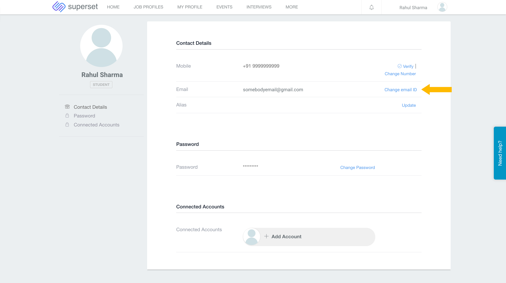

# How to change my email ID?

If you want to change your Superset Email ID or Phone Number. Then do the following - 

* Go to - [https://joinsuperset.com/](https://joinsuperset.com/) and click on Login.

* Now sign into your superset account - 

* Now click on the profile icon and then click on account - 

* Now click on the 'Change Email ID' or 'Change Number' to change your details - 

