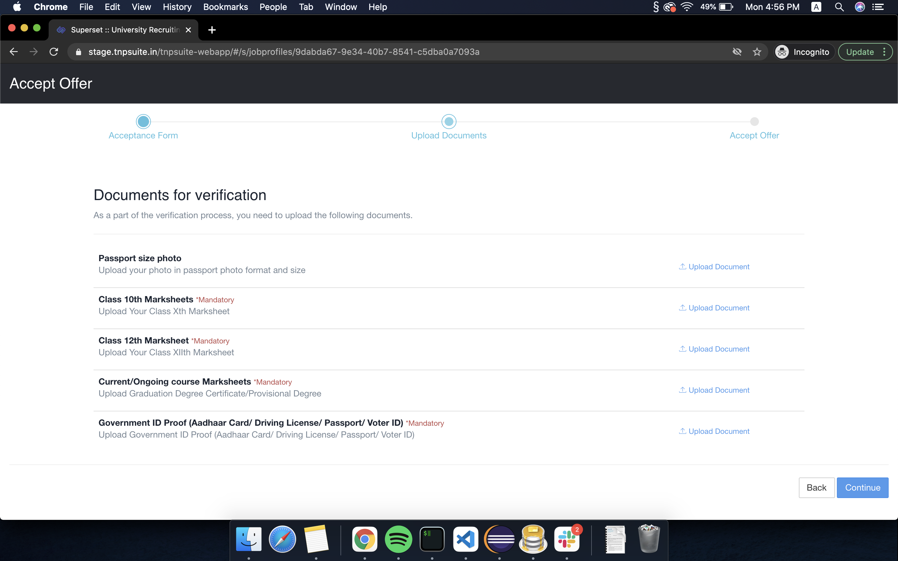

# How to accept an offer?


You will only be able to **Accept** an offer after the company you have applied for has enabled the job acceptance button

If you cannot see the **Accept** button then that means it has not yet been enabled. Please be patient.


* Go to the **Job Profiles** section from your Superset Home page
* Select the job profile that you have been offered
* After opening the job profile, you should be able to see the **Accept** button

* Fill the **Acceptance Form** after clicking on the accept button
* Upload the necessary documents

* Answer the questions in the final stage of offer acceptance

* Click on **Accept Offer** button
* You should see a dialogue box prompting you to enter the password

* Click on it to accept the job.
* After accepting the offer, you will be redirected to the Job Profile page where you should see your offer as **Accepted**

\*\*\*\*

