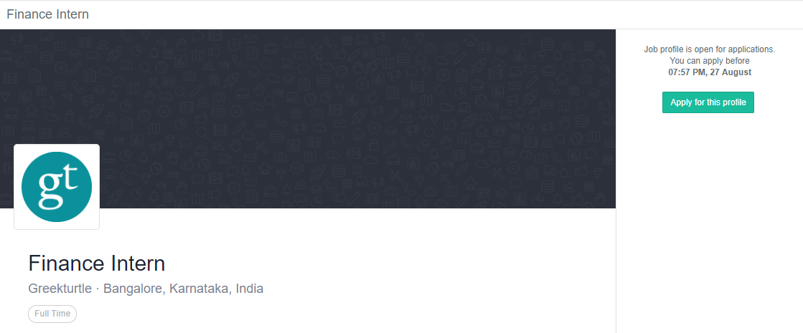
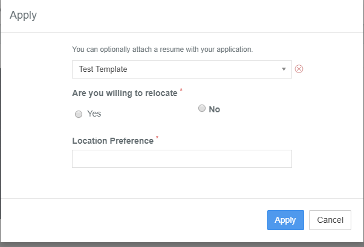
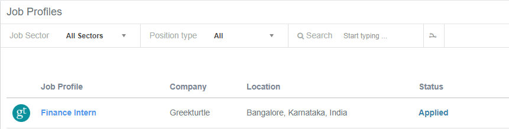

# How to apply for a Job Profile

* Click on the **Job Profiles** section on the homepage

* Then click on the job profile you want to apply for 

* The option to apply is available on the top right corner of the job profile page as shown.


* You will not see this button if you are **ineligible** for the job profile
* Please make sure that you meet the **eligibility criteria** of the job profile
* You can check this under the **Eligibility Criteria Evaluation Result** section


* Once you click on **Apply for this profile**, a window will pop up
*  You must **select the resume** via which you want to apply for this job.
* Also, you have to answer some additional questions \(if it has been added by the placement team while posting the job\) relevant to the job profile.

* After selecting the relevant resume and answering the questions, you need to click on Apply button.
* After applying, you will see the option to withdraw your application \(if applicable\)


The **Withdraw** button is only visible till the deadline has not lapsed

If you want to withdraw please do so before the deadline ends. After this, you will not be allowed to withdraw your application.


* When you go back to the previous page where all the job profiles are listed, you will see the status changes to **Applied** and you may receive an email mentioning that your application has been submitted successfully.

