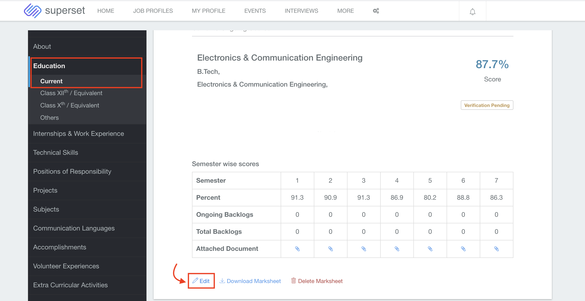
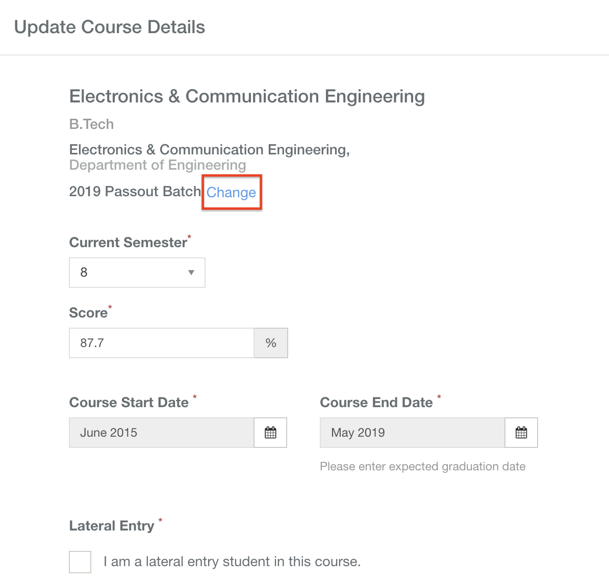
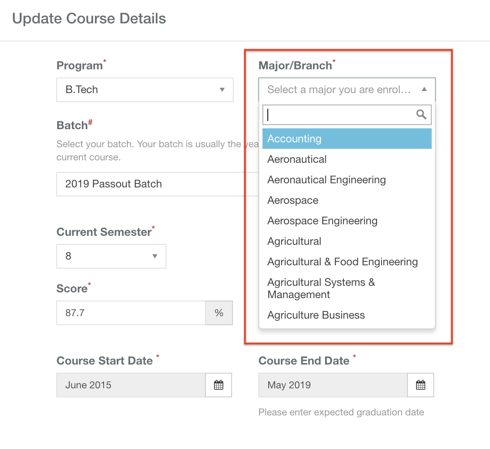

# How to change 10th/12th percentage, GPA


**NOTE -** If your **college placement office** \(or training and placement office or career development office\) **uses Superset** for placements, then you might not be allowed to change your Branch/Course/Department. 

In this case please get in touch with your college placement office.


If you want to change your 10th, 12th percentage, GPA or Branch/Course/Department, then please do the following - 

* Go to the **My Profile** tab 

* Go to the **Education** section as shown in the screenshot
* Click on the **Edit** button

* When you see the pop-up, click on the **Change** button

* Click on the **Major/Branch** dropdown to see the list of available majors
* Choose the correct major 
* 

* Click on the **Save** button at the bottom of the pop-up to save your changes

