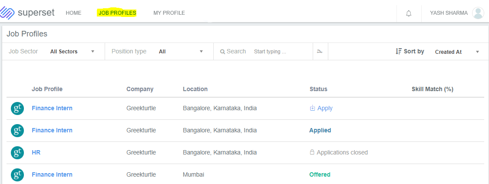
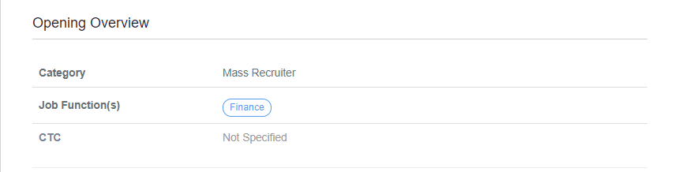
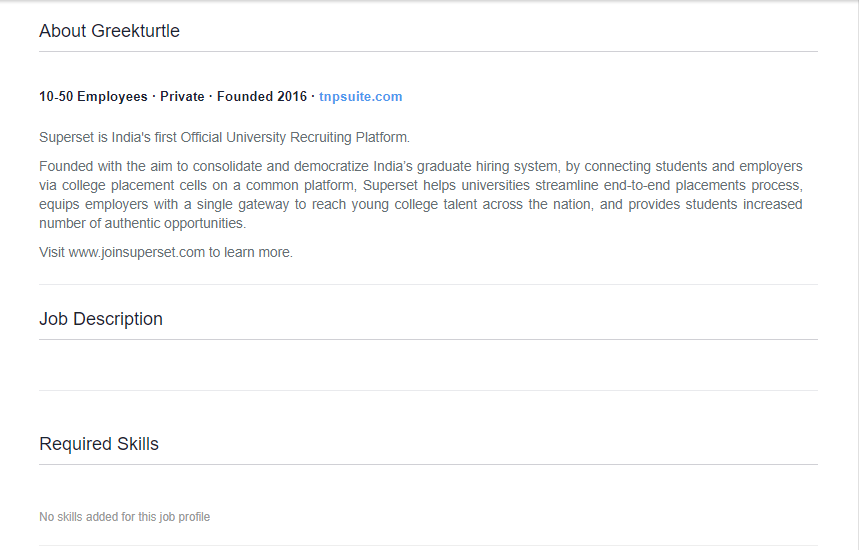
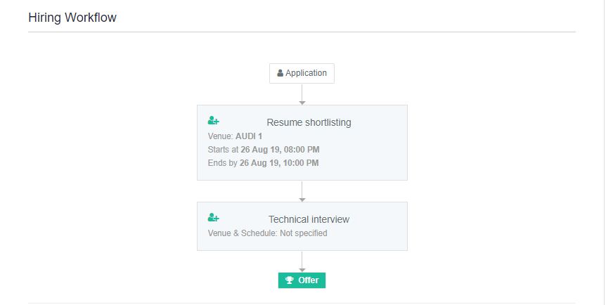
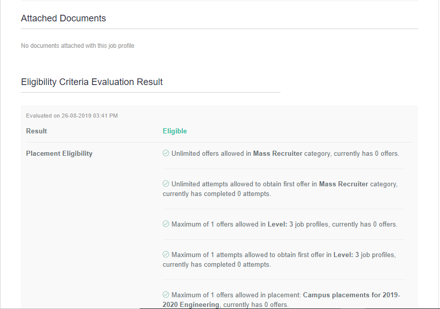

# Accessing Job Profiles

* Login to your profile and go to the **Job Profile** tab.

* In this section, you will find the list of all the job profiles posted in a placement cycle in which you are enrolled.

**Click on a job profile name to view its details as follows :-**

### Opening Overview 

It consists of the category in which the job profile falls into as per the placement policy \(as defined by placement team\), job function and the CTC that is being offered for this particular profile.

### About Company

It consists of relevant information about the company.

### Job Description

It consists of the detailed description of the job you are applying to.

### Required Skills

This section lists the skills required for the job profile

### Hiring Workflow

The stages for this particular job profile along with the venue, date and time of that particular stage \(if mentioned while posting the job\)

#### 

### Attached Documents

If any document/ presentation is attached with the job profile when posted by the placement team, it will reflect here.

### Eligibility Criteria Evaluation Result

Here you will see whether you are eligible or not eligible to apply for the job profile on the basis of the placement policy and the eligibility criteria that are mentioned while posting the job. 

If you see that you are **not eligible,** you may check which criteria you do not satisfy.

### 

